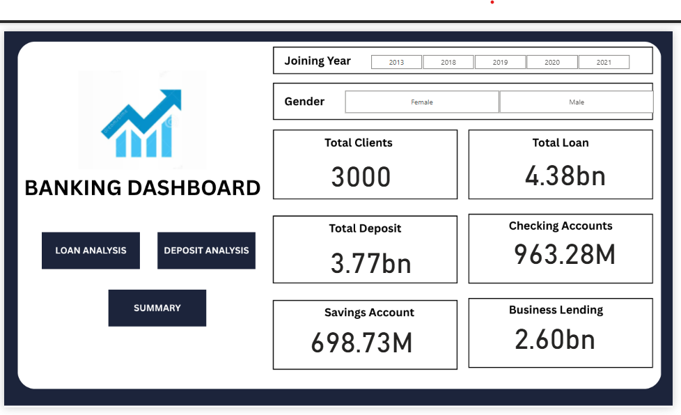
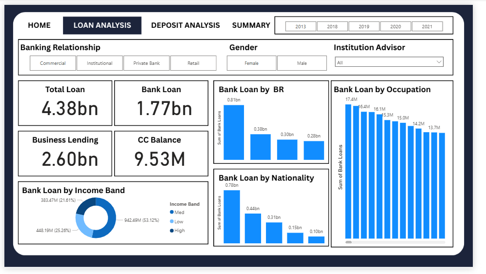
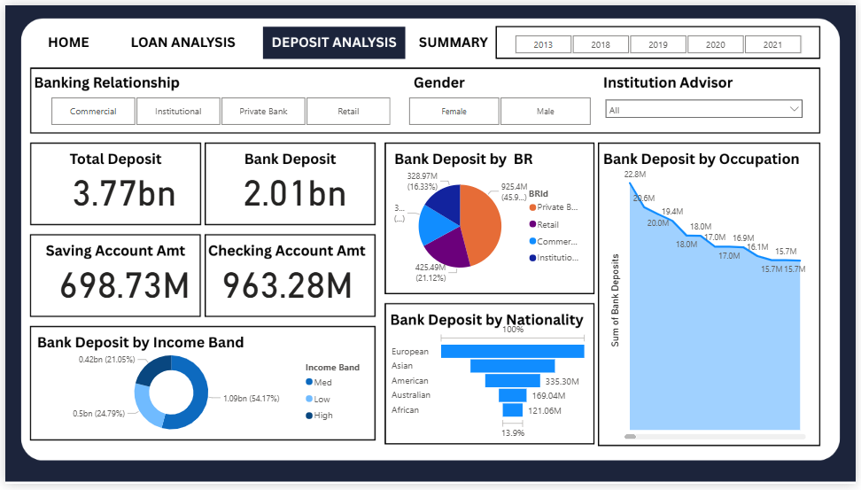

# Exploratory Data Analysis (EDA) Project - Banking

This project performs an in-depth **Exploratory Data Analysis (EDA)** on a given Banking dataset using Python and visualization tools. It also includes interactive **Power BI dashboards** for visual insights and trend analysis.

---

## 📊 Project Overview

The goal of this project is to:

* Understand data structure and relationships
* Perform data cleaning and preprocessing
* Generate meaningful insights using visualization
* Present key findings through **Power BI dashboards**

---

## 🧠 Tools & Technologies

* **Python** (Pandas, NumPy, Matplotlib, Seaborn)
* **Jupyter Notebook** – for EDA (`eda.ipynb`)
* **Power BI** – for interactive dashboards
* **Git & GitHub** – for version control

---

## 📁 Project Structure

```
📦 project-folder
 ┣ 📄 eda.ipynb
 ┣ 📊 dashboards/
 ┃ ┣ home.png
 ┃ ┣ loan_analysis.png
 ┃ ┣ deposit_analysis.png
 ┣ banking.csv
 ┣ 📄 README.md

```

---

## 🧩 How to Run the Notebook

1. Clone this repository:

   ```bash
   git clone https://github.com/aruk04/Banking-EDA.git
   cd <repo-folder>
   ```

2. Launch Jupyter Notebook:

   ```bash
   jupyter notebook eda.ipynb
   ```

---

## 📈 Power BI Dashboards

Below are previews of the Power BI dashboards created for this project.

### Dashboard 1 – Overview



### Dashboard 2 – Loan Analysis



### Dashboard 3 – Deposit Analysis



---

## 🧾 Results & Insights

* Key statistical summaries of dataset features
* Correlation analysis between key variables
* Data visualizations to identify patterns and trends
* Power BI dashboards for interactive exploration

---

## 🚀 Future Improvements

* Add predictive modeling layer
* Automate Power BI data refresh
* Expand dashboard with additional KPIs

---

